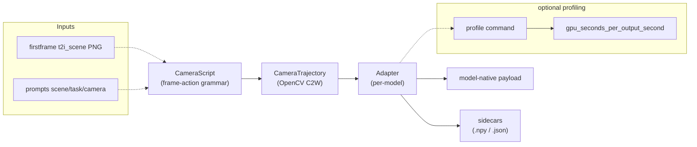

# wrcam

**Unified camera control for video-generation / world models — out of the box.**

`wrcam` lets you drive any supported video-generation model with the same `kind:direction:value@frames` grammar. You describe the camera motion once; wrcam compiles it into each model's native control payload and writes a set of auditable sidecars alongside the output path. By default it runs in **dry-run mode**: the payload is compiled and sidecars are written without invoking any model weights or GPU. Real video generation is available via **`LocalSubprocessBackend`** for reference models (`easyanimate-v51-camera`, `spatia`) when `wrcam.runtime.json` is configured ([docs/backends/README.md](docs/backends/README.md)).

---

## Features

- **Unified frame-action grammar** — one compact string format (`kind:direction:value@frames`) drives all supported models
- **Arbitrary rotation** — yaw/pitch/roll, any angle, any direction, near-per-frame granularity
- **Arbitrary translation** — pan/dolly/crane, any amount, any direction
- **Preset combinations** — `yaw_LR`, `yaw_RL`, `pan_LR`, `pan_RL`, `static`; or compose arbitrary motions with `sweep` and `go_return`
- **One adapter per model** — isolated translation layer; new models are two files + one import line
- **Auditable sidecars** — every compile run writes `.target_c2w.npy`, `.camera_trajectory.json`, `.camera.json`, `.model_control_samples.json`; dry-run also writes `.payload.json`
- **Numpy-only core** — payload compilation requires only numpy; no GPU needed
- **Resource profiling** — optional stdlib + `nvidia-smi` command wrapper with stage timing and `gpu_seconds_per_output_second` headline ([docs/cost-profiling.md](docs/cost-profiling.md))
- **Prompt generation** — camera NL text (stdlib), scene/task prompts via configurable LLM providers ([docs/prompts.md](docs/prompts.md))
- **First-frame generation** — T2I providers (mock / DashScope) output `{family_id}.png` + manifest ([docs/first-frame.md](docs/first-frame.md))

---

## Install

```bash
# From the repository root
pip install -e .
```

Requires Python ≥ 3.10. The only **core** runtime dependency is `numpy>=1.23`.

Optional extras:

```bash
pip install -e ".[prompts]"      # LLM prompt generation (httpx)
pip install -e ".[firstframe]"   # T2I first-frame generation (httpx, pillow)
pip install -e ".[all]"          # prompts + firstframe + dev
```

---

## Quickstart — Python

```python
import wrcam

# Compile using a preset string directly
result = wrcam.compile_camera(
    model="wan22-fun-5b-cam",
    camera="yaw:left:60@40,yaw:right:60@41",
    image="first.png",
    out="out.mp4",
)

# Compile using a preset builder
script = wrcam.presets.sweep("yaw", "left", 37, frames=49)
result = wrcam.compile_camera(
    model="wan22-fun-5b-cam",
    camera=script,
    image="first.png",
    out="out.mp4",
)

# List active models (reads src/wrcam/models/*.json)
print(wrcam.list_models())
```

`compile_camera` returns a dict with keys `model`, `payload`, `artifacts`, `prompt`, and `dry_run`. By default `dry_run=True`; no model weights are loaded.

**Full signature:**

```python
wrcam.compile_camera(
    *,
    model: str,
    camera: str | wrcam.CameraScript,
    out: str | Path,
    image: str | None = None,        # required for image/TI2V models
    source_video: str | None = None, # required for source-video/V2V models
    prompt: str = "",
    width: int = 832,
    height: int = 480,
    fps: int = 16,
    num_frames: int | None = None,
    work_dir: str | Path | None = None,
    dry_run: bool = True,
) -> dict
```

---

## Quickstart — CLI

> The CLI is being built in parallel with this documentation. The commands below describe the intended interface.

```bash
# List supported models (reads registry)
wrcam models

# List available presets
wrcam presets

# Inspect / validate a camera string
wrcam actions --camera "yaw:left:60@40,yaw:right:60@41"

# Compile camera payload and sidecars (dry-run by default)
wrcam generate \
  --model wan22-fun-5b-cam \
  --camera preset:yaw_LR \
  --image first.png \
  --out out.mp4

# Run adapter + registry health checks
wrcam doctor --all
wrcam doctor --model wan22-fun-5b-cam

# Profile a generation command (resource usage)
wrcam profile --out-dir profiles/ --model wan22-fun-5b-cam -- python gen.py

# Summarize resource profiles
wrcam profile-summary profiles/

# Camera prompt text (no extra deps)
wrcam prompt camera --preset yaw_LR

# First-frame PNG (mock provider)
wrcam firstframe --out first_frames/ --family-id demo --prompt "A cat." --provider mock
```

---

## How it works



1. **CameraScript** — your `kind:direction:value@frames` string (or a `CameraScript` object built via `wrcam.presets`) is parsed into a sequence of `FrameAction` segments.
2. **CameraTrajectory** — the builder converts the segment list into a smooth OpenCV C2W (camera-to-world) trajectory.
3. **Adapter** — the registered adapter resamples to the target frame count, applies per-model `rotation_gain` / `translation_gain` / `max_amount` from the registry, and translates the C2W trajectory into the model-native control representation (e.g. CameraCtrl W2C pose text rows, latent pose embeddings, geometry NPZ, action tokens, etc.).
4. **Payload + sidecars** — the adapter returns a `CameraPayload`; `compile_camera` writes the standard sidecar files alongside the output path.

---

## Sidecar outputs

All sidecar names are derived from the `out` path you pass to `compile_camera`. If `out="run/out.mp4"`, sidecars appear in `run/` with the prefix `out.mp4.*`.

| File suffix | Contents |
|---|---|
| `.target_c2w.npy` | OpenCV C2W target trajectory as a `(F, 4, 4)` float32 numpy array |
| `.camera_trajectory.json` | Full camera trajectory in JSON: per-frame poses, coordinate convention, frame count |
| `.camera.json` | Unified sidecar: camera script, model key, adapter, calibration status, artifact paths, coordinate convention |
| `.model_control_samples.json` | Model-native control timeline (`model_control_timeline`), payload type, frame count, and coordinate convention |
| `.payload.json` | *(dry-run only)* Full serialised payload: camera script, payload type, model key, model-native control data, metadata |

---

## Supported models

Run `wrcam models` to see the current list (23 active models + deferred entries). The registry is generated at import time from `src/wrcam/models/*.json`.

Per-model quickstart pages live under [`docs/models/`](docs/models/) (dry-run commands, default frame counts, real-generation notes).

For detailed capabilities and amplitude calibration, call `wrcam.model_record("<key>")` in Python or inspect the JSON files directly.

---

## Documentation

- [Camera-control grammar and pipeline](docs/camera-control.md) — frame-action syntax, worked examples, three-layer contract, amplitude calibration
- [Adding a model](docs/adding-a-model.md) — step-by-step guide to registering a new model JSON + adapter
- [Per-model guides](docs/models/) — one page per supported model with dry-run commands
- [Resource profiling / cost](docs/cost-profiling.md) — stage timing, GPU memory, fair headline metric
- [Prompt generation](docs/prompts.md) — scene, task, camera text, API assembly
- [First-frame generation](docs/first-frame.md) — T2I providers and manifest layout

---

## Status / scope

| Capability | Status |
|---|---|
| Frame-action grammar + preset compilation | Fully functional out of the box |
| Auditable sidecar writing | Fully functional out of the box |
| Dry-run payload inspection (no GPU) | Fully functional out of the box |
| Resource profiling (speed / VRAM) | Functional; requires `nvidia-smi` for GPU samples |
| Camera prompt text + API assembly | Functional (stdlib) |
| Scene/task prompt generation | Functional with `wrcam[prompts]` + API key |
| First-frame image generation | Functional with `wrcam[firstframe]` + provider key (or `mock`) |
| Real video generation | **Reference backends** for `easyanimate-v51-camera` and `spatia` via `local_subprocess` + `wrcam.runtime.json`; other models documented in [docs/backends/](docs/backends/) |

`wrcam` is extracted from [WRBench](https://github.com/wrbench) unified camera control. The camera-control compilation layer is complete and standalone. Real generation uses optional backends — see [docs/backends/README.md](docs/backends/README.md) and `wrcam.runtime.example.json`.

---

## License

Apache 2.0 — see [LICENSE](LICENSE).
